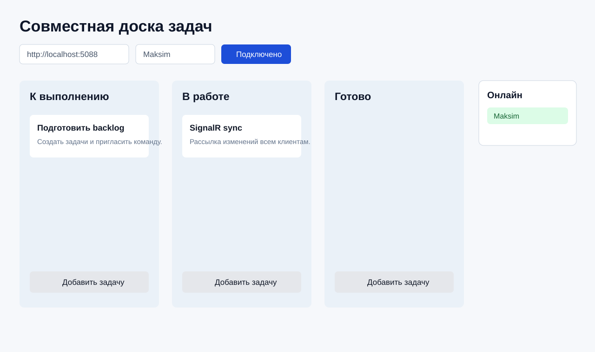

# LAB_PI_4 - Team Task Board

Кроссплатформенное клиент-серверное приложение для совместной работы с доской задач в локальной сети. Проект сделан по ТЗ для лабораторной работы 4: несколько клиентов подключаются к серверу, видят общую доску, редактируют задачи и получают обновления в реальном времени.



## Возможности

- Создание и удаление колонок.
- Добавление, редактирование, удаление и перемещение карточек задач.
- Автоматическая синхронизация между подключёнными клиентами через SignalR.
- Отображение пользователей онлайн.
- Локальное сохранение последней синхронизированной копии доски в JSON для офлайн-просмотра.
- Интернациональный интерфейс: русский и английский языки.
- MVVM-клиент без сетевой логики во View.

## Технологии

- `.NET 8` target framework, сборка локально через установленный `.NET SDK 10`.
- `Avalonia` для кроссплатформенного desktop UI на Windows и macOS.
- `CommunityToolkit.Mvvm` для ViewModel и команд.
- `ASP.NET Core SignalR` для real-time синхронизации.
- `xUnit` для автоматических тестов.
- `DocFX` для автособираемой документации.

## Структура

- `src/TaskBoard.Shared` - общие модели доски, колонок, карточек и пользователей.
- `src/TaskBoard.Server` - SignalR-сервер и in-memory состояние доски.
- `src/TaskBoard.Client` - Avalonia MVVM-клиент, SignalR client, встроенный сервер, LAN-обнаружение, локальный кэш, локализация.
- `tests/TaskBoard.Tests` - модульные тесты.
- `docs` - пользовательская документация и конфигурация DocFX.
- `.github/workflows/ci.yml` - build/test/publish/docs workflow для pull request.

## Запуск

1. Запустить клиент:

```bash
dotnet run --project src/TaskBoard.Client
```

2. Если этот компьютер должен быть сервером, нажать в окне клиента `Запустить сервер`.

Клиент автоматически:

- поднимет встроенный SignalR-сервер на порту `5088`;
- подставит локальный сетевой адрес;
- начнёт рассылать сервер в локальную сеть;
- подключится к своему серверу.

3. На втором компьютере запустить клиент:

```bash
dotnet run --project src/TaskBoard.Client
```

4. Выбрать сервер в списке `Найденные серверы` и нажать `Подключиться`.

Если автообнаружение не сработало из-за firewall или настроек сети, можно по-прежнему запустить отдельный сервер вручную:

```bash
dotnet run --project src/TaskBoard.Server --urls http://0.0.0.0:5088
```

И указать адрес вручную:

- на той же машине: `http://localhost:5088`;
- в локальной сети: `http://<IP-адрес-сервера>:5088`.

## Инструкция пользователя

1. Введите имя пользователя.
2. Если этот ПК должен принимать подключения, нажмите `Запустить сервер`.
3. На другом ПК выберите появившийся сервер в списке `Найденные серверы`.
4. Нажмите `Подключиться`.
5. Добавьте колонку через поле `Название колонки`.
6. Внутри колонки нажмите `Добавить задачу`.
7. Выберите карточку, измените заголовок/описание и нажмите `Сохранить`.
8. Используйте кнопки `Влево` и `Вправо`, чтобы перемещать выбранную карточку между колонками.
9. Переключайте язык кнопками `RU` и `EN`.

## Поддерживаемые платформы

- Windows 10/11.
- macOS.

Клиент построен на Avalonia, поэтому не зависит от WPF и Windows Desktop UI. macOS-сборка дополнительно проверяется в GitHub Actions на `macos-latest`.

## Проверка

```bash
dotnet restore LAB_PI_4.sln
dotnet build LAB_PI_4.sln
dotnet test LAB_PI_4.sln
```

## CI/CD и документация

При создании pull request GitHub Actions автоматически:

- восстанавливает зависимости;
- собирает решение на Windows и macOS;
- запускает тесты;
- публикует артефакты клиента и сервера;
- собирает документацию DocFX.

Для защиты `main` в GitHub нужно включить branch protection rule и требовать прохождения workflow `CI` перед merge.
